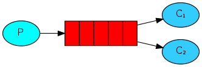
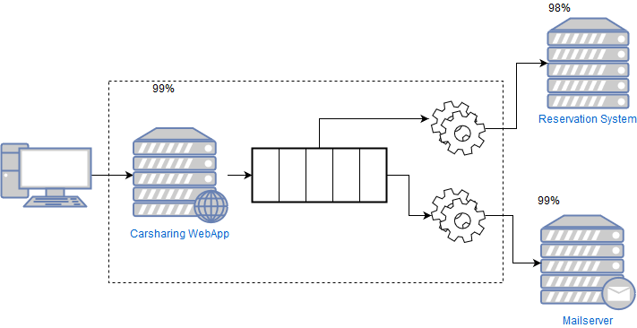
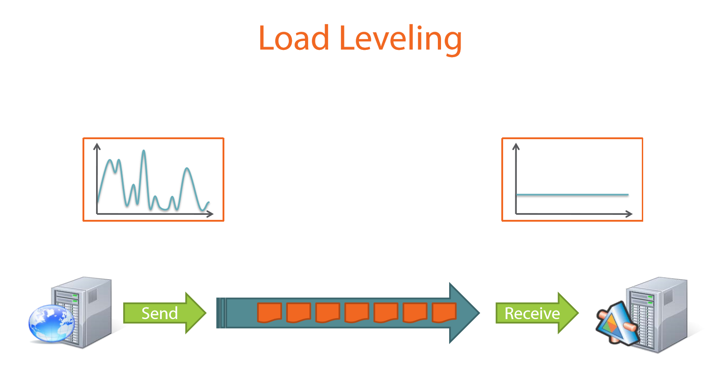
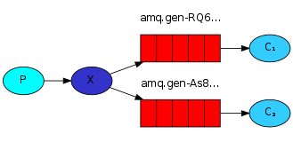
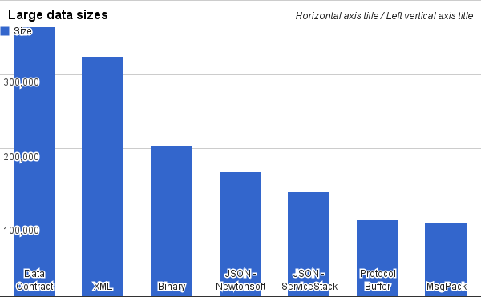
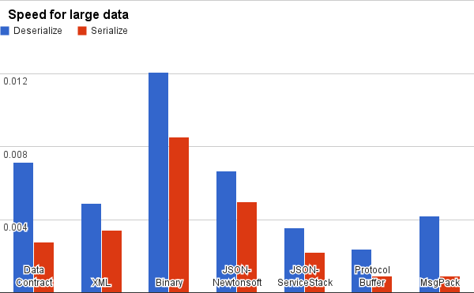

- title : Introduction to Messaging
- description : Light introduction into sending messages between software systems
- author : Karel Šťastný
- theme : night 
- transition : none

***

# Introduction to Messaging

' presentation - general overview, not tailored to specific technology
' terminology - will use general terms where possible, or RabbitMQ. Will explain Azure Service bus 

***

## Messaging

* Sending data between applications using some middleman
* Sender sends the data to a **queue**
* Receiver reads the data from a **queue** and reacts to them

' sender does not know who will receive the data!

***

## Messaging

* Sending **messages** between applications using **message broker**
* **Producer** sends the messages to a **queue**
* **Consumer** reads the messages from a **queue** and reacts to them

' sender does not know who will receive the data!

***

## Messaging

Source: <a href="www.rabbitmq.com">www.rabbitmq.com</a>

***

## Why Messaging

* Lower Coupling between applications
* Asynchronous Processing
* High Availability
* Load Leveling
* Load Balancing
* Scalability

' https://blog.iron.io/top-10-uses-for-message-queue/
' lower number of communication points, less dependencies (the same as lower coupling...)

***

## Messaging Scenarios

* **Point-to-Point** Messaging
* **Publish/Subscribe** Messaging
* Async **Request/Reply**
* *Data Streaming (Large Scale Telemetry, IoT)* - not covered

***

## Point-to-Point Messaging

* One **producer**, one **consumer**
* **Work Queue** (Task queue)
    * allows horizontal scaling of work - multiple consumers can process messages
    

Source: <a href="www.rabbitmq.com">www.rabbitmq.com</a>

' there might be more consumers but each message in the queue is only consumed by one (fair dispatch, QOS)
' examples - computing reports, log processing, sending emails
' https://www.rabbitmq.com/tutorials/tutorial-two-dotnet.html - the main idea behind Work Queues (aka: Task Queues) is to avoid doing a resource-intensive task immediately and having to wait for it to complete. Instead we schedule the task to be done later. We encapsulate a task as a message and send it to a queue. A worker process running in the background will pop the tasks and eventually execute the job. When you run many workers the tasks will be shared between them.

---

### Message

* **Data** transported between producer and consumer (byte array)
    * headers 
    * body

### Queue

* **Buffer** for storing messages
* Each message is sent only to one consumer

' `messageId`, `contentType`, `correlationId`, expiration, custom headers
' usually - if there is no error, e.g. network or process failure - processing reliability, delivery guarantees

---
### Examples

* Carsharing - book a car, make a car available
* Calculate a report
* Send email

***

### **DEMO** Point-to-Point

> FibRequestor  
> FibServer

' Show what happens when the server dies

***

## Reliable Delivery

* **Network** and Connectivity Problems
* **Hardware** Failures
* **Software** Crashes

' delivery = consumer has received and **processed** the message
' https://www.rabbitmq.com/reliability.html

---

### Delivery Guarantees

* **At-least-once**
    * Idempotent processing, message deduplication
* **At-most-once**
* *Exactly-once*

' exactly-once - a lot of debate whether this is possible, some messaging systems offer this (with plenty of caveats). I will skip this debate here (but it's not possible)
' example - how to make command idempotent - design as such, check for processed command

***

## High Availability

*** 
## High Availability

* What is the availability of Booking action?

***

## High Availability

* What is the availability of Booking action?

**[96%](https://en.wikipedia.org/wiki/High_availability#Percentage_calculation)**

`0.99 * 0.99 * 0.98 = 0.96`

' External systems decrease our availability!

***

## High Availability

' Availability for this particular usecase stays the same - the work will be done on backend afterwards

***
## Load Leveling

Source: <a href="https://app.pluralsight.com/library/courses/microsoft-azure-service-brokered-messaging/table-of-contents">Microsoft Azure Service Bus Brokered Messaging In-depth</a>

' producer sends data in bursts, consumer processes them at the same pace. can process everything during the day
' https://docs.microsoft.com/en-us/azure/architecture/patterns/queue-based-load-leveling
' Intermediating message producers and consumers with a queue means that the consuming application only has to be provisioned to be able to handle average load instead of peak load  - https://docs.microsoft.com/en-us/azure/service-bus-messaging/service-bus-queues-topics-subscriptions

***

## Advantages (of Point-to-Point)

* Lower coupling
* Asynchronous processing
* High Availability
* Load Leveling

' coupling - P does not need to know who will do the work. 
' Asynchronous - P does not have to wait. The work will be done eventually

***

## Publish/Subscribe Messaging

* One **producer**, many **consumers** of the same message
* Also called **publisher** and **subscriber**

Source: <a href="www.rabbitmq.com">www.rabbitmq.com</a>

' new component - `exchange` routes messages to `queues`
' Azure Service Bus - `topic`, bound to topics are `subscriptions`
' system notification - something has happened and other parts have to know about it. Changes in state, events, logging etc.
' https://www.rabbitmq.com/tutorials/tutorial-three-dotnet.html

---

### Exchange

* receives messages from producers and pushes them into queues
* needs rules that define where to push the messages

' necessary because we said that queue only delivers to one consumer
' in RabbitMq the rules are defined by exchange type
' = topic in Azure Service Bus

---

### Examples

* car positions and events (door open, engine off, car locked)
* chat
* broadcast of entity changes

*** 

### **DEMO** - Publish/Subscribe

> FibListener

***

### Message Routing

* Consumers can subscribe to a subset of messages
* Message Broker evaluates messages based on rules
    * RabbitMQ exchange types: fanout, direct, topic, headers
    * Azure Service Bus: filters (SQL, Correlation filter)

' e.g. carsharing client will only receive position of cars that are not booked
' do not go that deeply, just quickly explain possibilities
' correlation filter - filter by message headers
' https://www.rabbitmq.com/tutorials/tutorial-four-dotnet.html

***

### Message Serialization

* **speed** of serialization and deserialization
* **size** of serialized message
* human **readability**

' readability - low priority for internal systems, we should use internal logging for that

***

### Message Serialization

* **Text** vs **Binary**
* various options (XML, JSON, Protobuf, MsgPack, ...)

---

#### Serialization Comparison - Size

Source: <a href="https://maxondev.com/serialization-performance-comparison-c-net-formats-frameworks-xmldatacontractserializer-xmlserializer-binaryformatter-json-newtonsoft-servicestack-text/">https://maxondev.com/serialization-performance-comparison-c-net-formats-frameworks-xmldatacontractserializer-xmlserializer-binaryformatter-json-newtonsoft-servicestack-text/</a> 

---
#### Serialization Comparison - Size

      

Source: <a href="https://maxondev.com/serialization-performance-comparison-c-net-formats-frameworks-xmldatacontractserializer-xmlserializer-binaryformatter-json-newtonsoft-servicestack-text/">https://maxondev.com/serialization-performance-comparison-c-net-formats-frameworks-xmldatacontractserializer-xmlserializer-binaryformatter-json-newtonsoft-servicestack-text/</a> 

---
#### Serialization Comparison - Speed

Source: <a href="https://maxondev.com/serialization-performance-comparison-c-net-formats-frameworks-xmldatacontractserializer-xmlserializer-binaryformatter-json-newtonsoft-servicestack-text/">https://maxondev.com/serialization-performance-comparison-c-net-formats-frameworks-xmldatacontractserializer-xmlserializer-binaryformatter-json-newtonsoft-servicestack-text/</a> 

---
#### Serialization Comparison - Speed

      

Source: <a href="https://maxondev.com/serialization-performance-comparison-c-net-formats-frameworks-xmldatacontractserializer-xmlserializer-binaryformatter-json-newtonsoft-servicestack-text/">https://maxondev.com/serialization-performance-comparison-c-net-formats-frameworks-xmldatacontractserializer-xmlserializer-binaryformatter-json-newtonsoft-servicestack-text/</a> 

***

### Advantages (of Publish/Subscribe)

* Simpler Communication
* Decoupling of Producer and Consumer
* Consumer Responsibility

***

## Async Request-Reply

* **Request-Response** Messaging
* Remote Procedure Call (RPC)

Source: <a href="www.rabbitmq.com">www.rabbitmq.com</a>

*** 

### **DEMO** - Async Request-Reply

> FibAsyncClient

' Azure Service Bus works differently (uses SessionId to correlate request and response)    
' alternative: https://www.rabbitmq.com/direct-reply-to.html

***

### Advantages (of **Request-Reply**)

* Easy to scale up
* Fault Tolerance
* Natural Load Balancing
* No need for Service Discovery

' https://www.quora.com/Why-use-message-queues-for-a-request-response-pattern-which-is-synchronous-when-queues-are-asynchronous 
' https://dev.to/matteojoliveau/microservices-communications-why-you-should-switch-to-message-queues--48ia 
' https://www.rabbitmq.com/tutorials/tutorial-six-dotnet.html

***

## Handling Faults

* **Sending** Messages
* **Processing** Messages

***

### Sending Message Faults

* **Transient**
    * Network Error
    * Throttling exception 
* **Permanent**
    * Message Broker not available
    * Incorrect configuration    

***

### Sending Message Faults

* Retry
* Abandon

***

### Processing Message Faults

* Processing Failure (in consumer)
* Poison Message
* Expired Message

' Poison message - message with bad content, cannot even be parsed

***
### Processing Message Faults

* Retry
* Abandon
* Dead-Letter

***
### Dead-Letter Channel

Source: <a href="https://www.enterpriseintegrationpatterns.com/patterns/messaging/DeadLetterChannel.html">https://www.enterpriseintegrationpatterns.com/patterns/messaging/DeadLetterChannel.html</a>

***
### Handling Dead-lettered Messages

* Monitor and Decide
    * Abandon
    * Retry manually 
    * Fix Consumer and retry

' suggestion: at first, monitor the dead letter exchange and decide based on what kind of messages end up there    

***

## Monitoring

* Messages in queues (counts, trends)
* Any queues without consumers?
* Any failures to process messages?
* Dead-letter queues

***

### **DEMO** - RabbitMQ Administration application

***

### Wire Tap pattern

* allows monitoring and interception of all messages, even for Point-to-Point communication

Source: <a href="https://www.enterpriseintegrationpatterns.com/patterns/messaging/WireTap.html">https://www.enterpriseintegrationpatterns.com/patterns/messaging/WireTap.html</a>

' alternative - just use exchange and route once to consumer and once to monitor

***

## Messaging Disadvantages

* Increased complexity
* Single point of failure
* Observability - harder to track program flow

' https://bravenewgeek.com/the-observability-pipeline/

***
### When Not to Use

* simple or monolithic systems
* mostly synchronous processing
* little external dependencies

***

## How to Choose

* why do you need the queue?
* what are your requirements?
    * functionality 
        * advanced routing?
        * worker queue? pub/sub? data/event streaming?
        * delivery guarantees?
    * performance
    * scalability
    * cloud or onsite?
    * support, existing tools

***
## Messaging Systems

[Queues.io](http://queues.io)

### Honorable Mentions

* [RabbitMQ](https://www.rabbitmq.com/)
* [Apache Kafka](https://kafka.apache.org/)
* [NATS](https://nats.io/)
* [NSQ](https://nsq.io/)
* [ZeroMQ](http://zeromq.org/)
* [Azure Service Bus](https://azure.microsoft.com/en-us/services/service-bus/)

***

## Q&A

***

## (Recommended) Sources

* https://www.rabbitmq.com/
* https://www.iron.io/top-10-uses-for-message-queue/
* [Enterprise Integration Patterns](https://www.enterpriseintegrationpatterns.com/)
* https://bravenewgeek.com/
* [Microsoft Azure Service Bus Brokered Messaging In-depth](https://app.pluralsight.com/library/courses/microsoft-azure-service-brokered-messaging/table-of-contents)