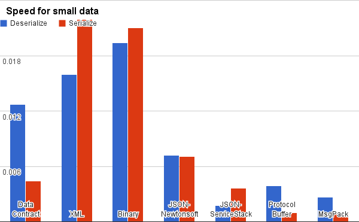

- title : Redis
- description : Redis Training
- author : Karel Šťastný
- theme : moon
- transition : default

***

## Redis

***

### Základní informace

* __Re__mote __Di__ctionary __S__ervice
* __in-memory__ úložiště
* data uchována jako __key-value__
* __single-threaded__
* optimalizovaná na vysoký výkon
* open source

***

### Verze a dostupnost

* Linux - Redis 4.0
    * https://redis.io/download
    * i Docker Image
* Windows - Redis 3.2.100 (již nepodporováno)
    * https://github.com/MicrosoftArchive/redis/releases
* Azure
    * https://azure.microsoft.com/en-us/services/cache/

***

### Použití Redis

* distribuovaná cache
* queues
* pub/sub
* leaderboard
* realtime stats
* full text vyhledávání
* časové řady
* geospatial data

' cache - session cache, cache jako u nás
' leaderboard - kolekce setříděná dle score (např. multiplayer hry)
' real time statistiky - počítání 
' https://redislabs.com/solutions/use-cases/
' counters https://redislabs.com/ebook/part-2-core-concepts/chapter-5-using-redis-for-application-support/5-2-counters-and-statistics/5-2-1-storing-counters-in-redis/


***

### Umístění Redis

#### Centralizované

      

* síťová latence při přístupu
* single point of failure
* konzistentní

---
#### Lokální

        

* eliminuje síťovou latenci
* nutnost synchronizace

' výhoda oproti pouhé inmemory cachi - perzistence, při pádu je cache naplněná

***
### Databáze v Redis

* klíče lze ukládat do databází (0..15)
* samostatná logická jednotka 
* některé funkce nepodporované (message broker)

' samostatná, ale sdílená paměť
' doporučuje se nepoužívat (ale je třeba o tom vědět) - oddělit prostředí např. prefixem klíčů

***
### Použití v .NET
* StackExchange.Redis
    * https://stackexchange.github.io/StackExchange.Redis/
    * výkonný klient, podporuje vše
* Microsoft.Extensions.Caching
    * https://docs.microsoft.com/en-us/aspnet/core/performance/caching/distributed
    * podpora pro distribuované cachování
    * ulehčí připojení k Redis

' Microsoft.Extensions.Caching - podmnožina funkcí, podporuje i SQL Server, in-memory
' my používáme oboje (viz dále) - vycházíme z Extensions, ale rozšiřujeme o nějaké možnosti

---

> Cvičení 1 - Redis Desktop Manager, CLI

* nainstalovat RDM, připojit se

' ukázka práce s RDM a CLI
' SET foo, GET foo
' seznam příkazů https://redis.io/commands

---

> Cvičení 2 - StackExchange.Redis

* instalovat StackExchange.Redis.StrongName
* multiplexer connection options: `happybook,password=redisUltraStrongPassword`
* uložit a načíst data

' https://stackexchange.github.io/StackExchange.Redis/Basics
' ukázat multiplexer, přístup k DB, strukturu příkazů v StackExchange, sync a async
' info o implicitních operátorech - třídy RedisKey, RedisValue
' https://github.com/StackExchange/StackExchange.Redis/blob/master/StackExchange.Redis/StackExchange/Redis/RedisKey.cs
' https://github.com/StackExchange/StackExchange.Redis/blob/master/StackExchange.Redis/StackExchange/Redis/RedisValue.cs

---

> Cvičení 3 - Microsoft.Extensions.Caching

* instalovat Microsoft.Extensions.Caching.Redis.Core (by Microsoft!)
* uložit a načíst data pomocí třídy RedisCache

' https://stackexchange.github.io/StackExchange.Redis/Configuration
' třída RedisCache a konfigurace

***
### Redis Klíče

* binary safe - lze použít cokoli (většinou string, ale klidně obrázek)
* nedoporučují se ani příliš dlouhé, ani příliš krátké
* ideálně čitelné klíče
* oddělovač je dvojtečka
* příkazy
    * `EXISTS`
    * `DEL`

```
user:1000:permissions
```

' klíče - ne nějaké hloupé zkratky

***

### Redis Hodnoty

* různé datové typy 
    * Redis je _data structures server_
* hodnoty jsou pole bytů

' data structures server - tvrdí dokumentace :) Týká se právě uložení hodnot

***

### Serializace

* Je třeba zvážit
    * rychlost serializace a deserializace
    * výslednou velikost (bandwidth)
    * čitelnost člověkem

---

#### Srovnání způsobů serializace - velikost


' https://maxondev.com/serialization-performance-comparison-c-net-formats-frameworks-xmldatacontractserializer-xmlserializer-binaryformatter-json-newtonsoft-servicestack-text/    

---
#### Srovnání způsobů serializace - velikost

      

' https://maxondev.com/serialization-performance-comparison-c-net-formats-frameworks-xmldatacontractserializer-xmlserializer-binaryformatter-json-newtonsoft-servicestack-text/    

---

#### Srovnání způsobů serializace - rychlost



' https://maxondev.com/serialization-performance-comparison-c-net-formats-frameworks-xmldatacontractserializer-xmlserializer-binaryformatter-json-newtonsoft-servicestack-text/    

---
#### Srovnání způsobů serializace - rychlost

      

' https://maxondev.com/serialization-performance-comparison-c-net-formats-frameworks-xmldatacontractserializer-xmlserializer-binaryformatter-json-newtonsoft-servicestack-text/    

***

### TTL

* klíč můžeme smazat pomocí příkazu `DEL`
* nebo omezit platnost
    * `EXPIRE`
    * `EXPIREAT`
* `TTL` vrátí čas do vypršení platnosti klíče 

' čas v sekundách, -2 klíč neexistuje, -1 nikdy nevyprší

***
### Datové typy
#### STRING

* základní datový typ
* hodnoty jsou jakákoli binární data (max. velikost 512 MB)
* příkazy (výběr, komplet viz https://redis.io/commands)
    * `GET`
    * `SET`
    * `INCR` atomické zvýšení hodnoty (pokud je uloženo číslo)
    * `MGET` hromadné načtení hodnot

' set možno nastavit, aby uspěl jen když klíč neexistuje či naopak
' NX - jen pokud neexistuje (možno použít jako zámek)

---
### Datové typy
#### LIST

* Linked list
    * rychlé přidání a odebrání (PUSH, POP), pomalejší přístup doprostřed
* možnost implementace fronty (LPUSH, RPOP), zásobníku (LPUSH, LPOP)
* příkazy
    * `LPUSH`
    * `LPOP`
    * `BLPOP` - blokující čtení
    * `LRANGE` - vrátí N položek
    * `LTRIM` - omezí délku seznamu
    * `RPOPLPUSH` - reliable queue, circular list

' příklad použití - např. task queue, přepočet reportů   
' uložení posledních příspěvků uživatele (Twitter) - LPUSH, LTRIM
' reliable queue RPOPLPUSH, see https://redis.io/commands/rpoplpush
' Redis sám vytváří klíče dle potřeby a maže prázdné
' BLPOP není podporován v StackExchange.Redis, důvod viz https://stackexchange.github.io/StackExchange.Redis/PipelinesMultiplexers (multiplexing single connection)

---

> Cvičení 4 - LIST

* ukázka - vytvoření fronty, zásobníku
* ukázka - reliable queue

' LPUSH list a b c d
' RPOP list
' BRPOP list
' RPOPLPUSH list relist

---
### Datové typy
#### HASH

* pod jedním klíčem uchová kolekci field-value 
* použití - ASP.NET distributed cache
* příkazy
    * `HGET`, `HMGET`, `HGETALL`
    * `HSET`, `HMSET`
    * `HINCRBY`

' pro uložení věcí, co logicky patří k sobě, ne místo serializace
' nákupní košík - ID je id košíku uživatele, key-value - ID produktu, počet produktů v košíku
' např. potřebujeme info o objektu co je uložen a nechceme ho tahat celý (viz cachování dále)


---
### Datové typy
#### SET

* množina - neseřazená kolekce unikátních hodnot
* umožňuje modelovat vztahy mezi objekty
    * `users:999:objects` 1 731 1418
    * `objects:online` 1 2 1789 2684
* množinové operace, náhodný výběr, kopie    
* statistiky - uživatelé přihlášení daný den 
    * `logged-in:2018-04-05`

' příklad - práva uživatele na všechny dané objekty
' pomocí množinových operací lze např. filtrovat, hodí se na čtení dle tagů (každý tag je jedna množina věcí, které do něho patří), kategorií
' viz příklad - SINTER vrátí všechny online objekty, na které má uživatel právo
' další možnost - nepřečtené zprávy za posledních 24 hodin (a na pozadí agent, který je trimuje)   

---

> Cvičení 5 - SET

* uložte do Redisu práva uživatele na objekty
* zjistěte, které z těchto objektů jsou online 
    * množina `objects:online` v Redisu

' já - naplnit online objekty, viz skript ex05
' SADD, SINTER, SMEMBERS

---
### Datové typy
#### SORTED SET

* množina prvků řazená dle skore (floating point number)
    * pokud je skore stejné, jsou klíče řazeny abecedně
* použití - leaderboard, analýza časových řad
* příkazy
    * `ZADD` přidá prvek s daným skore, případně updatuje skore
    * `ZRANGE`, `ZREVRANGE` vrátí prvky seřazené dle skore, dle daných indexů (od 0)
    * `ZRANK` pozice prvku
    * `ZRANGEBYSCORE` vrací prvky se skore mezi danými hodnotami (uzavřený interval, prvky se skore na hranici jsou vráceny)
    

' leaderboard - top N uživatelů, nejnavštěvovanější produkty, top zprávy Reddit/Hacker News - viz http://oldblog.antirez.com/post/take-advantage-of-redis-adding-it-to-your-stack.html
' ZADD - možno i inkrementovat
' příklad - asi by šlo použít na uchování stopy vozidla (či stop všech vozidel)

---

> Cvičení 6 - SORTED SET

* uložte do množiny `favnumber` své oblíbené číslo 
    * příkaz `ZADD`
* zjistěte, koho číslo je nejvyšší

' já - naplnit online objekty, viz skript ex05
' ZADD, ZRANGE, ZREVRANGE
' ukázka - vložit něco doprostřed, že se změní pořadí

---

### Datové typy
#### Další

* Bitmap - bitové pole
* HyperLogLog - odhad kardinality množiny (probabilistic data structure)
* viz https://redis.io/topics/data-types-intro

' obojí - úspora paměti (hyperloglog proto, že není třeba si pamatovat každý prvek množiny)
' bitmap - možno např. nastavit ID uživatele, který byl přítomen daný den, ID vozidla s jízdou apod.
' HyperLogLog - https://en.wikipedia.org/wiki/HyperLogLog

***
### Security

* předpokládá se přístup __důvěryhodných klientů v důvěryhodném prostředí__
* není podporováno šifrování, klient jej musí zajistit sám

* lze omezit přístup pouze na vybrané IP adresy
* lze nastavit heslo pro přístup (jedno, pro všechny stejné)
* lze přejmenovat nebezpečné příkazy (např. `CONFIG`)
* výchozí instalace je v __protected módu__, tj. přístup pouze z loopback adresy

' heslo - doporučuje se dostatečně dlouhé (kvůli rychlosti Redisu)


***
### Perzistence

* RDB (Redis database)
    * Snapshot databáze, vytvářený v určitých intervalech
    * disaster recovery, replikace
* AOF (Append Only file)
    * log všech operací
    * nedochází ke ztrátě dat (riziko max. 1 sekundy, lze nastavit)
    * více vytěžuje server
    * může být poměrně velký - pravidelně se kompaktuje


' snapshot - může dojít ke ztrátě dat (v případě pádu mezi zápisem a uložením)
' snapshot - intervaly dané časově i dle počtu změn, možno více kombinací

***

### Čištění dat

* Při použití jako cache, můžeme vyhradit pouze část paměti
    * výchozí nastavení - neomezeně pro 64b systémy, 3GB pro 32b
* konfigurace
    * VOLATILE vs. ALL
    * LRU, RANDOM, TTL, LFU, noeviction
* kvůli výkonu je algoritmus pouze aproximací, není 100% přesný    


' při překročení se mažou staré klíče
' nastavuje se jednou hodnotou, ale kombinují se vlastně dvě
' volatile - mažou se pouze klíče, které mají nastavenou expiraci (např. nechci přijít o konfiguraci v cachi)
' noeviction - při dosažení paměti se při zápisu vyhodí výjimka
' https://redis.io/topics/lru-cache

***
### Další témata
* Pipelining
* Transakce
* Message Broker (publish/subscribe)
* Keyspace notifications
* Lua skriptování
* Replikace, Sentinel, Sharding

***

### Zdroje
* https://www.miroslavholec.cz/blog/uvod-do-redis-a-prakticke-navrhove-vzory--wug-praha-2017
* https://redis.io/
* https://redislabs.com/solutions/use-cases/
* Redis Time series https://redislabs.com/solutions/use-cases/redis-timeseries-data/
* https://redislabs.com/ebook/foreword/ Redis in Action
