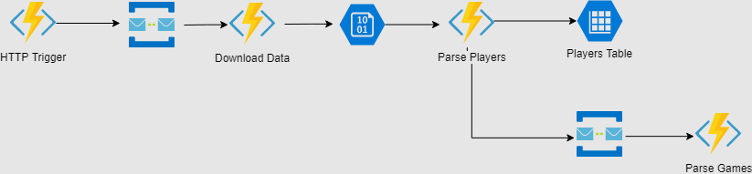

- title : Azure Functions
- description : Overview of Azure Functions for the noninitiated
- author : Karel Šťastný
- theme : night 
- transition : none

***

# Azure Functions

***

## Serverless

* Cloud provider fully manages server infrastructure
* You only worry about application code and business logic

' https://bravenewgeek.com/serverless-on-gcp/
' obligatory definition of serverless. who doesn't know what is serverless? who knows? skip or not

***

### Serverless Flavors

* Compute
* Databases
* Storage
* Message Queues

' Compute - Functions, Lambda; Databases - SQL, CosmosDb; Storage - BlobStorage, S3;

***

### Serverless Benefits

* Focus on providing value to your customer
* "Outsource" operations related tasks
* Automatic scaling

***

## Azure Functions

* Serverless computing service on Azure
* Function as a Service 
* Stateless*
* Event-Driven
 
 
*except Durable Functions

' FaaS - run code without managing own server/container or own long lived application
' no worry about infrastructure - just write function, define how to run it and run. No need for complex deployment process
' stateless - Durable Functions are stateful but I will not talk about them

***

### Benefits

* No need to maintain infrastructure
* Eliminated boilerplate
* Rapid and simple development
* Lower cost
* Automated scaling

' pricing - you pay only when the function runs (pay as you go). optionally also dedicated plan. Premium plan in preview, see https://docs.microsoft.com/en-us/azure/azure-functions/functions-scale
' Azure Web Apps - Functions based on WebJobs. Kudu, CI etc. available
' autoscaling - you cannot over or under provision

***

### Drawbacks

* Vendor lock-in
* Performance - cold start
* No in-server state
* DLL Hell reminders

' Security - bigger attack vector than single app
' cold start - https://mikhail.io/serverless/coldstarts/azure/
' https://martinfowler.com/articles/serverless.html#drawbacks for stuff to talk about

***

## Use Cases
 
* System Glue
' Automating processes
' Scheduled jobs
* Full backend application
* Dynamic workloads

' glue - simple to develop, has to be small and flexible. glue - integration of services, apps apod.
' Automating processes - e.g. webhook for automatic restart on alarm
' Dynamic workloads - because of autoscaling
' replaces webjobs

***

## Examples

* Automatic log cleaning
* Automatic restart of App Service on alarm (webhook)
* Automatic data import
* Refresh of search index

' log cleaning - DB and files from app service

***

### Azure Functions Versions

* v1 - .NET Framework 4.7
* v2 - .NET Core 2.2
    * recommended version
    * support for some languages dropped (bash, php, F# Scripts)

' https://docs.microsoft.com/en-us/azure/azure-functions/functions-versions
' I will show v2 only

***

### **DEMO** Create Function (F#)

> HTTP Hello world

' possible in portal but good just for demo purposes, therefore we won't be doing that

***

### Function App

* "Project" for Azure Functions
* Multiple functions
* Shared configuration
* Deployed as one unit

' you can think of it as your "app service" or "web" that has the functionality
' show in Azure Portal

***

### Function Triggers

* define how the function will start
* each function has exactly one trigger
* often has payload which is provided to the function

' https://docs.microsoft.com/en-us/azure/azure-functions/functions-triggers-bindings

***

### Function Triggers

* HTTP
* Timer
* Blob Storage
* Cosmos DB
* Azure Service Bus
* Azure Queues
* ...

' we already saw HTTP Trigger, I will present more later

***

### Function Bindings

* Allow connecting function to another resource
* Optional
* Function may have multiple bindings
* `input`, `output` or both
* Abstracts access to other services

' one function can have multiple bindings, `in` or `out` parameters https://docs.microsoft.com/en-us/azure/azure-functions/functions-triggers-bindings

***

### Function Bindings

* Blob Storage
* Cosmos DB
* SignalR
* Table Storage
* Storage Queues
* Service Bus

***

### **DEMO** Function Triggers and Bindings

> Getting Statistics from [BoardGameGeek](https://boardgamegeek.com/geekplay.php?userid=199696&redirect=1&startdate=&dateinput=&dateinput=&enddate=&action=bydate&subtype=boardgame)

' problem - get data about games from BoardGameGeek and somehow process them

***

#### Demo pipeline

' HTTP Launcher - will queue the task. Then queue will trigger download, then blob will be parsed and result goes to TableStorage
' NOTE: BlobTrigger processes blobs that were already present but the trigger did not see them before
' NOTE: normally the design would be different (e.g. BlobTrigger would just fill various queues) but I want to add new things one at a time, therefore the awkward architecture

***

### **DEMO** Function Settings

* Configurable the same way as Azure App Service
    * e.g. `local.settings.json`
    * Azure portal

' show how to read configuration in demo app
' show local.settings.json. Show settings in portal

***

### Securing HTTP Functions

* Function Keys
    * Host Keys
    * Function Keys
* IP Whitelisting

' Function Keys are meant for development
' https://docs.microsoft.com/en-us/azure/azure-functions/functions-bindings-http-webhook#authorization-keys
' Host - Master key - Admin Access
' Query string or `x-functions-key` header
' Gateway - IP whitelisting https://docs.microsoft.com/en-US/azure/app-service/app-service-ip-restrictions
' http://blog.aakashsharma.me/azure/2018/01/06/azure-functions-restricting-public-access-and-ip/
' IP whitelisting - CIDR format https://en.wikipedia.org/wiki/Classless_Inter-Domain_Routing

***

### Deployment

* Manual
    * CLI Tooling
    * IDE Tooling (Visual Studio, VS Code, Rider)
* Automated
    * Azure DevOps
    * Deployment Center

' plenty of options, I will show manual ones
' CLI, IDE - nice for testing before CI is set
' CI - show Deployment Center or Azure DevOps (same as deploying App Service)        
' Deployment Center - needs special structure of app. https://docs.microsoft.com/en-us/azure/azure-functions/functions-continuous-deployment 

***

### **DEMO** Deployment

* JetBrains Rider
* CLI

' CLI `func azure functionapp publish functionsdemo82` (needs `az` or `Az.Accounts` PowerShell module. login with `az login`)

***

### Hosting plans

* Consumption
* App Service Plan
* Premium (preview)

* different plans have different [limits](https://docs.microsoft.com/en-us/azure/azure-functions/functions-scale)

' pricing differes
' App Service - you have to set the scaling correctly but you pay nothing extra ("only" for the app service plan)
' Premium - consumption with extra features (no cold start, unlimited execution duration, ...)
' https://docs.microsoft.com/en-us/azure/azure-functions/functions-scale
' Consumption plan - can be limited by daily usage quota. https://azure.microsoft.com/is-is/pricing/details/functions/
' minimum execution time and memory for a single function execution is 100 ms and 128 mb respectively (i.e. one run is minimum of 1/80 GB-sec)

*** 
### Monitoring

* AppInsights
* Azure Portal - **Monitor**
* Log Streaming

' LogStreaming - need to enable `fileLoggingMode` in host.json
' Function execution logs are stored in Table storage. It is developers responsibility to remove those? see also https://markheath.net/post/three-ways-view-error-logs-azure-functions
' AppInsights, see https://docs.microsoft.com/en-us/azure/azure-functions/functions-monitoring

' logging https://stackoverflow.com/questions/53405020/configure-loglevel-of-azure-function-using-environment-variables
' + https://docs.microsoft.com/en-us/dotnet/api/microsoft.extensions.logging.loglevel?view=aspnetcore-2.2

***

## Q&A

***

### Azure Functions Prerequisities

* Command line - [Azure Functions Core Tools](https://docs.microsoft.com/en-us/azure/azure-functions/functions-run-local)
* VS Code - Core Tools + [Azure Functions Extension](https://github.com/Microsoft/vscode-azurefunctions)
* Visual Studio - [Azure Functions and WebJobs Tools](https://docs.microsoft.com/en-us/azure/azure-functions/functions-develop-vs)
* JetBrains Rider - [Azure Toolkit](https://plugins.jetbrains.com/plugin/11220-azure-toolkit-for-rider)

***

## Sources

* You can find this talk on my github https://github.com/kstastny/Talks

* Develop in F# using VS Code
    * [Precompiled F#](https://discardchanges.com/post/building-azure-functions-with-precompiled-fsharp/)
    * [F# Scripts](https://discardchanges.com/post/building-azure-functions-with-fsharp-and-vscode/1-setup/)

* [Designing for the Serverless Age • Gojko Adzic](https://www.youtube.com/watch?v=w7X4gAQTk2E&t=2s)
* [Azure Functions Documentation](https://docs.microsoft.com/en-us/azure/azure-functions/)