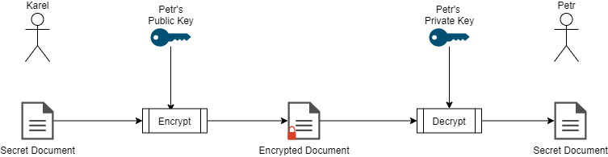
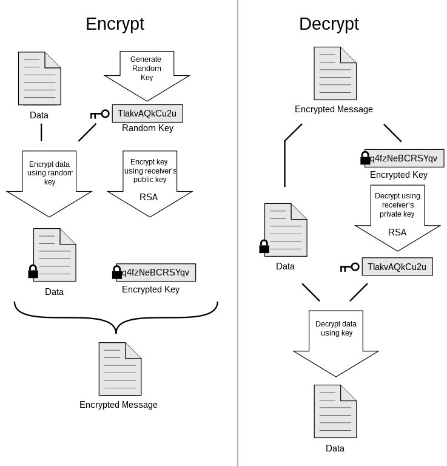
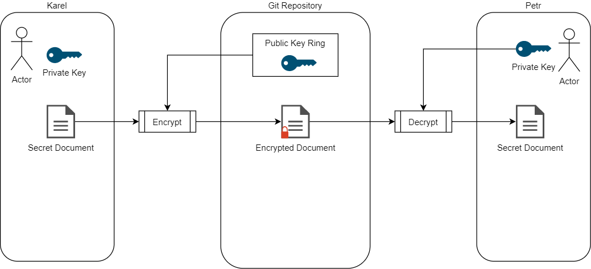

- title : Git Secret
- description : 
- author : Karel Šťastný
- theme : night 
- transition : none

***

  

' 


***

# Git Secret

## Karel Šťastný

***

## Secrets

- database connection strings
- Azure, AWS accesses
- 3rd party API credentials
- ...


- necessary to run the application

***

## Sharing Secrets
### Common Solutions

- directly in git repo
- project wiki, Confluence etc.
- separate repo with restricted access
- password managers (1Password, BitWarden, LastPass)
- nowhere - send by email, SMS, slack, carrier-pigeon

***

### Complications

- sharing securely
- sync with correct version of source code
- Continuous Deployment setup

***

### Other Solutions

- encrypt secrets in repo
    - symmetric encryption
    - asymmetric encryption

' symmetric - easy, just share a key and anyone who has the key has access
' disadvantage - removal of trust, security of key
' Asymmetric - allows us to better manage who has access, beats having one shared key

***  

## Asymmetic Cryptography



***


## Git Secret

- bunch of scripts to simplify asymmetric encryption of secrets
- encrypt and store files inside git repository
- safely share secrets between devs
- decrypt during automated deployment

' secrets are versioned controled

***

### GPG

- GnuPG, open source implementation of [PGP](https://en.wikipedia.org/wiki/Pretty_Good_Privacy)
- Encrypt, Decrypt, Sign and Verify documents
- Manage public and private keys

' https://www.devdungeon.com/content/gpg-tutorial

***

' ### PGP Encryption

 

' 


***

### Git Secret Overview




***


### Git secret

> Sharing files with git secret

' immediately show example

***

### Preparation

#### Install (Debian systems) I


```bash
sudo apt install gnupg make man git gawk
```

```bash
sudo apt install git-secret
```

```bash
git secret --version
```

https://web.archive.org/web/20220703064608/https://git-secret.io/installation

' at the moment, original domain git-secret.io is not working due to sanctions
' FYI only, I will share the talk on github. We will not go through that now


' #### Install (Debian systems) II

' ```bash
' sudo sh -c "echo 'deb https://gitsecret.jfrog.io/artifactory/git-secret-deb git-secret main' >> /etc/apt/sources.list"
' wget -qO - 'https://gitsecret.jfrog.io/artifactory/api/gpg/key/public' | sudo apt-key add -
' sudo apt-get update && sudo apt-get install -y git-secret

' git secret --version
' ```

***

#### GPG generate

```bash
gpg --gen-key
```
*** 

#### GPG export key

```bash
gpg --armor --export your.email@address.com > public-key.gpg
```

' send to whoever manages the keys

***

#### GPG import key

```bash
gpg --import public-key.gpg
```

***

#### Init Git Secret

```bash
git secret init
```

```bash
git secret tell karel@example.org
```
***

#### Encrypt files

```bash
git secret add secrets.txt
```

```bash
git secret hide
```

***

#### Access to other users

```bash
git secret tell petr@example.org
```

```bash
git secret hide
```
***

#### Decrypt files

```bash
git secret reveal
```

' should be root directory of git repo

***

## The Good

- solved sharing of secrets
- simple usage
- can be used as part of CI/CD pipeline

' not demonstrated, we are not using this

***

## The Bad

- no direct Windows support for those to whom this matters
    - some people may have problems setting up
- reveal needs to run from root .git directory, sometimes confusing

***

## The Ugly

- error messages not very helpful
- secrets cannot be merged - conflicts in binary files
- developers need to be careful not to overwrite each others stuff 

' overwrite - cannot be caught by code review

***

## Sources

Slides at https://github.com/kstastny/Talks

* https://sobolevn.me/git-secret/
* https://github.com/sobolevn/git-secret
* https://gnupg.org/index.html