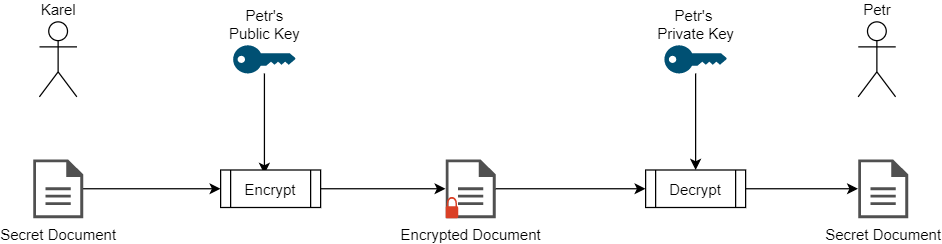

- title : Git Secret
- description : 
- author : Karel Šťastný
- theme : night 
- transition : none

***

# Git Secret

## Karel Šťastný

***

## Issues with secrets

- Cannot be stored in git repo because of their confidential nature
- separate storage may be out of sync, hard to identify related version
- extra step for CD pipeline - get secrets from "somewhere"
- often stored in wiki, outdated

***  

## Solution - Git Secret

- encrypt and store files inside git repository
- safely share secrets between devs
- decrypt during automated deployment

' secrets available for correct version
' secrets are versioned control

***

## Asymmetic Cryptography



***

## Asymmetic Cryptography II

Why for Git secret?

' Allows us to better manage who has access, beats having one shared key

***

## GPG

- GnuPG, open source implementation of [PGP](https://en.wikipedia.org/wiki/Pretty_Good_Privacy)
- Encrypt, Decrypt, Sign and Verify documents
- Manage public and private keys

' https://www.devdungeon.com/content/gpg-tutorial

***
### Install (Debian systems) I

Install the prerequisities

```bash
sudo apt install gnupg make man git gawk
```

Install git-secret

```bash
sudo apt install git-secret
```

https://web.archive.org/web/20220703064608/https://git-secret.io/installation

' at the moment, original domain git-secret.io is not working due to sanctions
' FYI only, I will share the talk on github. We will not go through that now

***

### Install (Debian systems) II

```bash
sudo sh -c "echo 'deb https://gitsecret.jfrog.io/artifactory/git-secret-deb git-secret main' >> /etc/apt/sources.list"
wget -qO - 'https://gitsecret.jfrog.io/artifactory/api/gpg/key/public' | sudo apt-key add -
sudo apt-get update && sudo apt-get install -y git-secret

git secret --version
```

***

### GPG generating keys

```bash
gpg --gen-key
```

```bash
gpg --armor --export your.email@address.com > public-key.gpg
```

' send to whoever manages the keys

***

### GPG import key

```bash
gpg --import public-key.gpg
```

***

## Git secret Usage


> Sharing files with git secret

' immediately show example

***
## TODO Git secret Usage


***

### Init Git Secret

```bash
git secret init
```

```bash
git secret tell karel@example.org
```
***

### Encrypt files

```bash
git secret add secrets.txt
```

```bash
git secret hide
```

***

### Access to other users

```bash
git secret tell petr@example.org
```

```bash
git secret hide
```
***

### Decrypt files

```bash
git secret reveal
```

' should be root directory of git repo

***

## The Good

- solved sharing of secrets
- simple usage
- can be used as part of CI/CD pipeline

' not demonstrated, we are not using this

***

## The Bad

- no direct Windows support for those to whom this matters
- reveal needs to run from root .git directory, sometimes confusing


***

## The Ugly

- error messages not very helpful
- secrets cannot be merged - developers need to be careful not to overwrite

***

## Sources

Slides at https://github.com/kstastny/Talks

* https://sobolevn.me/git-secret/
* https://github.com/sobolevn/git-secret
* https://gnupg.org/index.html


*********** REMOVE STUFF BELOW
## John H. Conway


<p class="reference">Photo by
Denise Applewhite, Office of Communications, Princeton.edu</p>  

' https://www.princeton.edu/news/2020/04/14/mathematician-john-horton-conway-magical-genius-known-inventing-game-life-dies-age

***

## Game of Life


<p class="reference"><a href="https://commons.wikimedia.org/wiki/File:Gospers_glider_gun.gif">https://commons.wikimedia.org/wiki/File:Gospers_glider_gun.gif</a></p>  

***

## Rules

 1. Any live cell with two or three live neighbours survives.
 1. Any dead cell with three live neighbours becomes a live cell.
 1. All other live cells die in the next generation. Similarly, all other dead cells stay dead.

***

## Implementation

***  

## Sources

* You can find this talk on my github https://github.com/kstastny/Talks
* https://en.wikipedia.org/wiki/Conway%27s_Game_of_Life
* [John Conway on Game of Life](https://www.youtube.com/watch?v=R9Plq-D1gEk)
* https://fable.io/docs/
