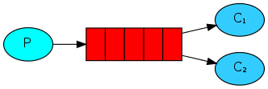
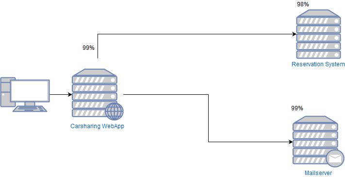
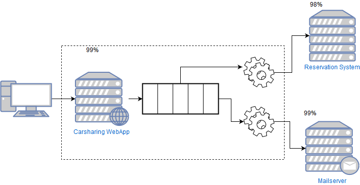
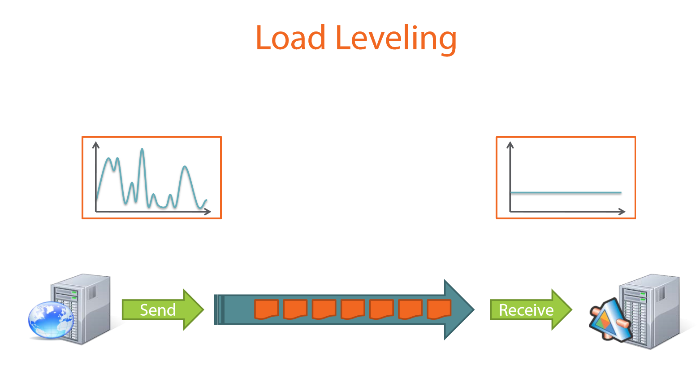
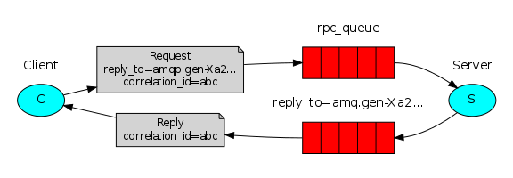
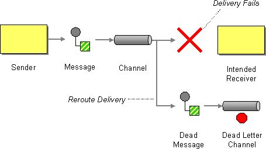

- title : Messaging in Distributed Systems
- description : Sending messages between software systems using message brokers
- author : Karel Šťastný
- theme : night 
- transition : none

***

# Messaging in Distributed Systems

' presentation - general overview, not tailored to specific technology
' terminology - will use general terms where possible, or RabbitMQ

***

## Messaging

* Sending data between applications using some middleman
* Sender sends the data to a **queue**
* Receiver reads the data from a **queue** and reacts to them

' sender does not know who will receive the data!

***

## Messaging

* Sending **messages** between applications using **message broker**
* **Producer** sends the messages to a **queue**
* **Consumer** reads the messages from a **queue** and reacts to them

' sender does not know who will receive the data!

***

## Messaging

Source: <a href="www.rabbitmq.com">www.rabbitmq.com</a>

***

## Why Messaging

* Lower Coupling
* Asynchronous Processing
* High Availability
* Load Leveling
* Load Balancing
* Scalability

' https://blog.iron.io/top-10-uses-for-message-queue/
' lower number of communication points, less dependencies (the same as lower coupling...)

***

## Messaging Scenarios

* **Point-to-Point** Messaging
* **Publish/Subscribe** Messaging
* Async **Request-Reply**
* *Data Streaming (Large Scale Telemetry, IoT)* - not covered

' point-to-point: Command, pub/sub: Event, Request/Reply: Query

***

## Point-to-Point Messaging

* One **producer**, one **consumer**
* **Work Queue** (Task queue)
    

Source: <a href="www.rabbitmq.com">www.rabbitmq.com</a>

' there might be more consumers but each message in the queue is only consumed by one (fair dispatch, QOS)
' horizontal scaling
' https://www.rabbitmq.com/tutorials/tutorial-two-dotnet.html - the main idea behind Work Queues (aka: Task Queues) is to avoid doing a resource-intensive task immediately and having to wait for it to complete. Instead we schedule the task to be done later. We encapsulate a task as a message and send it to a queue. A worker process running in the background will pop the tasks and eventually execute the job. When you run many workers the tasks will be shared between them.

---

### Message

* **Data** transported between producer and consumer (byte array)
    * headers 
    * body

' `messageId`, `contentType`, `correlationId`, expiration, custom headers
' usually - headers are important for messaging system, body is important for recipient

### Queue

* **Buffer** for storing messages
* Each message is *delivered* only to one consumer

' usually - if there is no error, e.g. network or process failure - processing reliability, delivery guarantees
' delivered - processed and acknowledged
' also called a `channel`

---
### Examples

* Carsharing - book a car, make a car available
* Calculate a report
* Send email

***

### **DEMO** Point-to-Point

> FibRequestor  
> FibServer

' show load distribution between two consumers
' Show what happens when the server dies and tell about options (delivery guarantees), mention idempotency

***

## High Availability

' Scenario: user wants to reserve a car at particular hour (that's what brings us money!)
' explain image, show how dependency system being down influences our action of focus (conversion)

*** 
## High Availability

* What is the availability of the Reservation action?

***

## High Availability

* What is the availability of the Reservation action?

**[96%](https://en.wikipedia.org/wiki/High_availability#Percentage_calculation)**

`0.99 * 0.99 * 0.98 = 0.96`

' External systems decrease our availability!
' goes from about 15 minutes/day to 1 hour per day

***

## High Availability

' Availability for this particular usecase stays the same - the work will be done on backend afterwards

***
## Load Leveling

Source: <a href="https://app.pluralsight.com/library/courses/microsoft-azure-service-brokered-messaging/table-of-contents">Microsoft Azure Service Bus Brokered Messaging In-depth</a>

' producer sends data in bursts, consumer processes them at the same pace. can process everything if average processing power >= input
' https://docs.microsoft.com/en-us/azure/architecture/patterns/queue-based-load-leveling
' Intermediating message producers and consumers with a queue means that the consuming application only has to be provisioned to be able to handle average load instead of peak load  - https://docs.microsoft.com/en-us/azure/service-bus-messaging/service-bus-queues-topics-subscriptions
' example: Black Friday - everyone wants to buy. 

***

## Advantages (of Point-to-Point)

* Lower coupling
* Asynchronous processing
* High Availability
* Load Leveling

' coupling - P does not need to know who will do the work. 
' Asynchronous - P does not have to wait. The work will be done eventually

***

## Publish/Subscribe Messaging

* One **producer**, many **consumers** of the same message
* Also called **publisher** and **subscriber**

Source: <a href="www.rabbitmq.com">www.rabbitmq.com</a>

' new component - `exchange` routes messages to `queues`
' Azure Service Bus - `topic`, bound to topics are `subscriptions`
' system notification - something has happened and other parts have to know about it. Changes in state, events, logging etc.
' https://www.rabbitmq.com/tutorials/tutorial-three-dotnet.html

---

### Exchange

* receives messages from producers and pushes them into queues
* needs rules that define where to push the messages

' necessary because we said that queue only delivers to one consumer
' in RabbitMq the rules are defined by exchange type (fanout, direct, topic, headers)
' = topic in Azure Service Bus
' you can also think of exchange as a router - receives the message and sends it to N other channels

---

### Examples

* car positions and events (door open, engine off, car locked)
* chat
* broadcast of entity changes
* logs

*** 

### **DEMO** - Publish/Subscribe

> FibListener

' one listener gets messages from multiple servers
' two listeners - both get the same messages

***

### Advantages (of Publish/Subscribe)

* Simpler Communication
* Decoupling of Producer and Consumer
* Consumer Responsibility

***

## Async Request-Reply

* **Request-Response** Messaging
* Remote Procedure Call (RPC)

Source: <a href="www.rabbitmq.com">www.rabbitmq.com</a>

---
### Examples

* query remote data - cars available in some area
* reserve a car with acknowledgement

*** 

### **DEMO** - Async Request-Reply

> FibAsyncClient

' Azure Service Bus works differently (uses SessionId to correlate request and response)    
' alternative: https://www.rabbitmq.com/direct-reply-to.html
' Scale out demo - `[1..50] |> List.iter fibAsync` - see how far we get before getting timeouts (1 vs 3 servers)

***

### Advantages (of **Request-Reply**)

* Easy to scale up
* Fault Tolerant
* Resilient
* Natural Load Balancing
* No need for Service Discovery

' https://www.quora.com/Why-use-message-queues-for-a-request-response-pattern-which-is-synchronous-when-queues-are-asynchronous 
' https://dev.to/matteojoliveau/microservices-communications-why-you-should-switch-to-message-queues--48ia 
' https://www.rabbitmq.com/tutorials/tutorial-six-dotnet.html
' fault tolerance - service downtime does not mean lost work, client might not even notice
' resilient - you will not overload the worker as the worker decides its load
' https://stackoverflow.com/questions/37148836/what-is-service-discovery-and-why-do-you-need-it

***

## Messaging Scenarios Summary

* *Command* - use Point-to-Point Messaging
* *Event* - use Publish/Subscribe Messaging
* *Query* - use async Request-Reply

' note that if you want command acknowledged, you have to use request/reply even if you don't really have a "query"

***

## Handling Processing Faults

* Processing Failure (bug in consumer, unavailable dependency...)
* Poison Message
* Dead Message
    * Expired, without consumers

' Poison (invalid) message - message with bad content, cannot even be parsed, will never be processed
' poison message - e.g. client deployed before server, server does not understand the new format

***
### Processing Message Faults

* Retry
* Abandon
* Dead-Letter

***
### Dead-Letter Queue

Source: <a href="https://www.enterpriseintegrationpatterns.com/patterns/messaging/DeadLetterChannel.html">https://www.enterpriseintegrationpatterns.com/patterns/messaging/DeadLetterChannel.html</a>

***

### Handling Dead-Lettered Messages

* Monitor and Decide
    * Abandon
    * Retry manually 
    * Fix Consumer and retry

' suggestion: at first, monitor the dead letter exchange and decide based on what kind of messages end up there    
' in practice poison and dead messages may end up in the same queue, you decide :)

***

## Monitoring

* Messages in queues (counts, trends)
* Any queues without consumers?
* Any failures to process messages?
* Dead-letter queues

***

### **DEMO** - RabbitMQ Administration application

***

## Messaging Disadvantages

* Increased complexity
* Single point of failure
* Observability - harder to track program flow

' https://bravenewgeek.com/the-observability-pipeline/

***
### When Not to Use

* Simple or monolithic systems
* Mostly synchronous processing
* Few external dependencies

***

## How to Choose

* why do you need messaging?
* what are your requirements?
    * functionality 
        * advanced routing?
        * worker queue? pub/sub? data/event streaming?
        * delivery guarantees?
    * performance
    * scalability
    * cloud or onsite?
    * support, existing tools
* [Queues.io](http://queues.io)

***
## Messaging Systems

* [RabbitMQ](https://www.rabbitmq.com/)
* [Apache Kafka](https://kafka.apache.org/)
* [NATS](https://nats.io/)
* [NSQ](https://nsq.io/)
* [ZeroMQ](http://zeromq.org/)
* [Azure Service Bus](https://azure.microsoft.com/en-us/services/service-bus/)

***

## Q&A

***

## (Recommended) Sources

* https://www.rabbitmq.com/
* https://www.iron.io/top-10-uses-for-message-queue/
* [Enterprise Integration Patterns](https://www.enterpriseintegrationpatterns.com/)
* https://bravenewgeek.com/
* [Microsoft Azure Service Bus Brokered Messaging In-depth](https://app.pluralsight.com/library/courses/microsoft-azure-service-brokered-messaging/table-of-contents)

***

## Bonus: Duplicate Messages

* *Problem: How do you handle duplicate messages?*

***

### How can duplicates appear?

* Network is unreliable
* Double submit

' unreliable - you always have to assume that the network is not reliable, not just in cell phone scenarios
' unreliable example - stuck in a full train, decide to book a car for ride back home. Suddenly you lose signal, go into a tunnel
' double submit - order on webshop, user double-clicks instead of single clicking

***

### When can duplicates appear?

* On publish
* On consume

' publish - e.g. cell phone going out of range, user going into tunnel, lost packets
' consume - consumer processes message but crashes before acknowledging to broker

***

### How do you handle duplicate messages?

* don't :)
* design your Consumers to be *idempotent*
* deduplicate

' don't - sometimes it does not matter if you receive and handle message twice (e.g. when you clear the cache twice once in a blue moon)
' idempotent - messages have to be designed that way. (e.g. you want to clear cache based on input data. Store time when you refreshed, when you get older event, do not recalculate)
' deduplication - usually uses unique MessageId (or hash) to filter duplicate messages. Broker support (RabbitMQ plugin, Azure Service Bus, ...) solves the duplicates on publish. Duplicates on consume you have to handle yourself (or use transactional client where possible - e.g. NServiceBus)

***

### Deduplication

* store IDs of processed messages, check before processing
* devil is in the details
    * number of processed messages
    * deduplication time window
    * speed of deduplication
    * memory/storage requirements
    
' I cannot go very deeply as I never needed to implement that
' Solution greatly depends on your needs - scalability, number of processed messages. That determines the tradeoffs
' time window or count of messages
' process locally, commit transaction and THEN confirm to msg store

***

### Deduplication Optimizations

* Partition the messages and process in parallel
* use Bloom filter

' Bloom filter - probabilistic data structure, allows you to quickly check if element is in the set (result is - definitely not there; may be there)
' Bloom filter - in memory, combine with set stored persistently
' https://llimllib.github.io/bloomfilter-tutorial/

***

## Sources

* https://segment.com/blog/exactly-once-delivery/
* http://eng.tapjoy.com/blog-list/real-time-deduping-at-scale
* https://llimllib.github.io/bloomfilter-tutorial/
