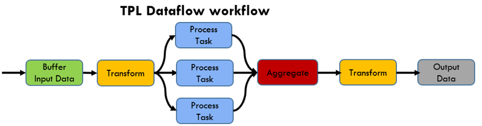
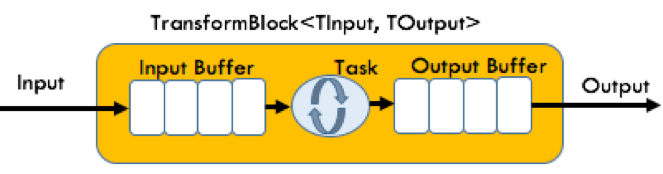

- title : TPL Dataflow
- description : 
- author : Karel Šťastný
- theme : night 
- transition : none

***

# TPL Dataflow

## Karel Šťastný

***

## TPL Dataflow

* enables effective techniques for running embarrassingly parallel problems
* built-in support for throttling and asynchrony
* explicit control over how data is buffered and moves around the system
* often obviates the need for synchronization locks 

' explain embarrassingly parallel
' https://www.dotnetcurry.com/patterns-practices/1483/parallel-workflow-dotnet-tpl-dataflow 

***

## TPL Dataflow (alt)

POINT of this slide - sell TPL Dataflow, explain advantages

* increase robustness of concurrency-enabled applications
* asynchronous
* actor-based
* dataflow and pipelining tasks
* message passing and parallelizing CPU-intensive and I/O-intensive applications that have high throughput and low latency
* explicit control over how data is buffered and moves around the system
* often obviates the need for synchronization locks 

' https://docs.microsoft.com/en-us/dotnet/standard/parallel-programming/dataflow-task-parallel-library

***

## Pipes & Filters

TODO use this slide or not?

POINT of this and following slides - explain the pattern to ease transition to TPL Dataflow

TODO explain the pattern

***

## Pipeline

TODO use this slide or not?

TODO something like this?
https://docs.microsoft.com/en-us/azure/architecture/patterns/_images/pipes-and-filters-message-queues.png

***

## TPL Dataflow Pipeline

  

<a href="https://www.dotnetcurry.com/patterns-practices/1483/parallel-workflow-dotnet-tpl-dataflow">https://www.dotnetcurry.com/patterns-practices/1483/parallel-workflow-dotnet-tpl-dataflow</a>
  

' TODO my own image of pipeline (just multiple boxes connected by lines) ?
' Blocks compose pipelines and networks
' Composable - big strength, blocks can be reordered, removed, added, even during runtime

***

## Dataflow Blocks

* Structures that buffer and process data

' TODO my own image - show input, output, input buffer, func, output buffer
' consume, produce, propagate/transform data
' data is buffered
' TODO talk about info from https://blog.stephencleary.com/2012/09/introduction-to-dataflow-part-1.html

***

## Block Types

TODO images

* Source
* Target
* Propagator

***

## Linking Blocks

* Blocks are connected by "linking" them

`source.LinkTo(target)`

' PropagateCompletion, Append, MaxMessages

***

### **DEMO** Simple Pipeline

> BasicPipeline

' TODO show - how it runs sequentially in context of one block
' TODO show - how it can run in parallel in context of one block
' explain how to setup everything - how to create and link blocks, how to send data (Post and Async), how to receive data (ActionBlock or AsObservable)

***

## Block Completion

* blocks should not expect any more messages
* allows a block to finish processing messages

TODO example, await task, error handling
***

## Error Handling

* Faulted Blocks
* Error Propagation

' see https://jack-vanlightly.com/blog/2018/4/18/processing-pipelines-series-tpl-dataflow
' faulted block - when function in block throws unhandled exception, block moves to faulted state, stops accepting data. recommendation - always try..catch, return Results
' await .Completion on last block to catch exceptions
' PropagateCompletion also propagates errors

***

### **DEMO** Completion and Error Handling

> Parallel batch processing

TODO prepare demo - we will create pipeline, calculate fibonaccis in parallel and write them out when we have all of them. This will also stop the pipeline
TODO error demo - send negative number to be calculated - kills the pipeline but displays error (fib has to raise exception on this)

***

***

## Block Categories

TODO either skip or remove?
    TODO INSTEAD - talk about a few block types and when they can be useful, examples with images (messaging style)
        - TransformBlock (above)
        - TransformManyBlock
        - BroadcastBlock (load shedding)
        - BatchBlock (not possible to do by time, has to be implemented anew)
        - JoinBlock?

* categories: buffering, execution, grouping
' https://jack-vanlightly.com/blog/2018/4/18/processing-pipelines-series-tpl-dataflow + docs

***

## Message propagation
TODO extra info, show what happens with multiple targets, multiple sources and how to filter 
    TODO who publish/subscribe mechanism, aggregations
    TODO multiple targets - normally only one block gets the message, show how the message can be duplicated (see ParallelPipeline in DPE)

* source may have multiple targets, target may have multiple sources
* example
    * aggregation (from parallel IO processing) - see DPE prototype with parallel
    * 

* target - consume, postpone or decline message

***

## BackPressure and Load Shedding

***

## Use Cases

TODO show pipeline processing example first, then other examples as alternative uses
TODO spread the use cases around

* Batch processing - limit concurrency (parallel processing)
* limit number of parallel calls to external system - similar to batch, mb don't do it
* pipelines - processing messages in microservice
* async with huge data streams ? mb skip

* examples - easy integration with Rx.NET

***

## "Case Study"

TODO example from Riccardo Terrell, if I use it
    - probably a nice example of pipeline, read https://www.dotnetcurry.com/patterns-practices/1483/parallel-workflow-dotnet-tpl-dataflow and study the code

***

## Sources

* You can find this talk on my github https://github.com/kstastny/Talks
* https://www.dotnetcurry.com/patterns-practices/1483/parallel-workflow-dotnet-tpl-dataflow
* https://jack-vanlightly.com/blog/2018/4/18/processing-pipelines-series-tpl-dataflow

***

## Q&A
