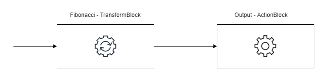
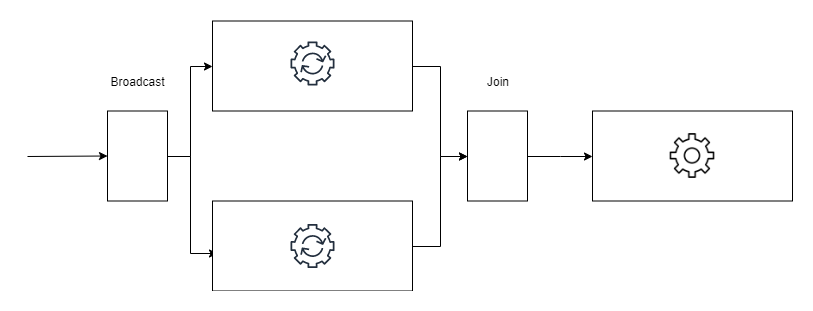

- title : TPL Dataflow
- description : 
- author : Karel Šťastný
- theme : night 
- transition : none

***

# TPL Dataflow

## Karel Šťastný

***

## TPL Dataflow

* dataflow and pipelining tasks
* actor-based
* asynchronous

***

### Advantages

* robust concurrent applications
* easy parallelization
* no need for locks
* explicit control
* throttling

***

## TPL Dataflow Pipeline

  

<a href="https://www.dotnetcurry.com/patterns-practices/1483/parallel-workflow-dotnet-tpl-dataflow">https://www.dotnetcurry.com/patterns-practices/1483/parallel-workflow-dotnet-tpl-dataflow</a>
  

' Blocks compose pipelines and networks
' Composable - big strength, blocks can be reordered, removed, added, even during runtime

***

## Dataflow Blocks

* Structures that buffer and process data

' consume, produce, propagate/transform data
' data is buffered

***

## Block Types

* Source
* Target
* Propagator

***

## Linking Blocks

`source.LinkTo(target)`

' PropagateCompletion, Append, MaxMessages

***

### **DEMO** Simple Pipeline

> BasicPipeline

***

## Block Completion

* pipeline does not need to be eternal
* `Complete` method
* `Completion` Task

***

## Error Handling

* Faulted Blocks
* Error Propagation

' see https://jack-vanlightly.com/blog/2018/4/18/processing-pipelines-series-tpl-dataflow

***

### Error Propagation

<a href="https://www.dotnetcurry.com/patterns-practices/1483/parallel-workflow-dotnet-tpl-dataflow">https://www.dotnetcurry.com/patterns-practices/1483/parallel-workflow-dotnet-tpl-dataflow</a>
  

***

### **DEMO** Completion and Error Handling

> ParallelBatchProcessing

***

### TransformBlock

' https://www.blinkingcaret.com/2019/06/05/tpl-dataflow-in-net-core-in-depth-part-2/
' https://jack-vanlightly.com/blog/2018/4/18/processing-pipelines-series-tpl-dataflow + docs

***

### TransformManyBlock

***

### BroadcastBlock

***

### JoinBlock

***

### **DEMO** Block Types

> BlockSamples

***

### Back-Pressure and Load Shedding

' `BroadcastBlock` vs `TransformManyBlock`
' https://jack-vanlightly.com/blog/2018/4/18/processing-pipelines-series-tpl-dataflow

***

### **DEMO** Back-Pressure and Load Shedding

> BackPressureLoadShedding

***

### Example - Processing Pipelines

* https://jack-vanlightly.com/blog/2018/4/18/processing-pipelines-series-tpl-dataflow ([Source Code](https://github.com/Vanlightly/StreamProcessingSeries/tree/master/src/net-apps/InProcStreamProcessing.TplDataflow))

***

### Example - Processing a Large Stream of data

* https://www.dotnetcurry.com/patterns-practices/1483/parallel-workflow-dotnet-tpl-dataflow ([Source Code](https://github.com/dotnetcurry/TPL-Dataflow))

***

## Sources

* You can find this talk on my github https://github.com/kstastny/Talks
* [Ricardo Terrell](https://www.dotnetcurry.com/patterns-practices/1483/parallel-workflow-dotnet-tpl-dataflow)
* [Jack Vanlighty: Processing Pipelines Series](https://jack-vanlightly.com/blog/2018/4/18/processing-pipelines-series-tpl-dataflow)
* [Dataflow documentation](https://docs.microsoft.com/en-us/dotnet/standard/parallel-programming/dataflow-task-parallel-library)

***

## Q&A
